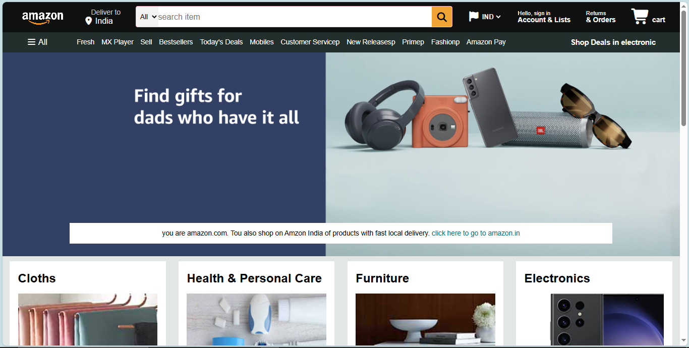

# 🛒 Amazon Clone (Frontend UI Project)

A fully responsive **Amazon Homepage Clone** built using **HTML5 and CSS3**.  
This project replicates the layout, design structure, and styling of Amazon's homepage to improve frontend development skills.

---

## 🚀 Live Features

- 🏠 Amazon-style Navigation Bar
- 🔍 Functional Search UI Design
- 📍 Delivery Location Section
- 🌎 Country Selector
- 🛍️ Product Category Grid Layout
- 🖼️ Hero Banner Section
- 📦 Shopping Cart Icon
- 📑 Multi-column Footer Section
- 🎯 Hover Effects & UI Interactions
- 📱 Responsive Layout using Flexbox

---

## 🛠️ Tech Stack

- HTML5
- CSS3
- Flexbox
- Font Awesome Icons
- Responsive Design Principles

---

## 📂 Project Structure

Amazon-Clone/
│── index.html  
│── amzn.css  
│── images/  
│── amazon_logo.png  
│── hero_image.jpg  
│── box1_image.jpg ...  

---

## 🎨 UI Components Implemented

### 🔹 Navbar
- Logo
- Delivery location
- Search bar with category dropdown
- Language selector
- Sign in section
- Orders section
- Cart icon

### 🔹 Panel Section
- Navigation links
- Deals highlight section

### 🔹 Hero Section
- Background image banner
- Promotional message container

### 🔹 Product Grid
- 8 Product category boxes
- Background images
- Hover border effects

### 🔹 Footer
- Back to top button
- 4 Column information layout
- Copyright section

---

## 💡 Key CSS Concepts Used

- Flexbox (Alignment & Layout Control)
- Hover Effects
- Background Images
- Responsive Width Handling
- Box Model
- Typography Styling
- Border Effects

---

## 🧠 What I Learned

- Building complex navigation layouts
- Structuring large UI components
- Creating reusable CSS classes
- Improving alignment using Flexbox
- Designing real-world website clones
- Writing clean and organized HTML structure

---

## 🔮 Future Improvements

- 🔥 Add JavaScript functionality
- 🛒 Make cart interactive
- 🔎 Add working search functionality
- 📱 Improve full mobile responsiveness
- 🌙 Add Dark/Light mode toggle
- 📦 Add product slider / carousel
- 🌍 Add real backend integration

---

## 📸 Screenshot

---

## ⚠️ Disclaimer

This project is created for **educational purposes only**.  
It is not affiliated with or endorsed by Amazon.

---

## 👨‍💻 Author

**Harshit Vishwakarma**  
B.Tech Student | Frontend Developer 🚀  

---

⭐ If you like this project, please give it a star!